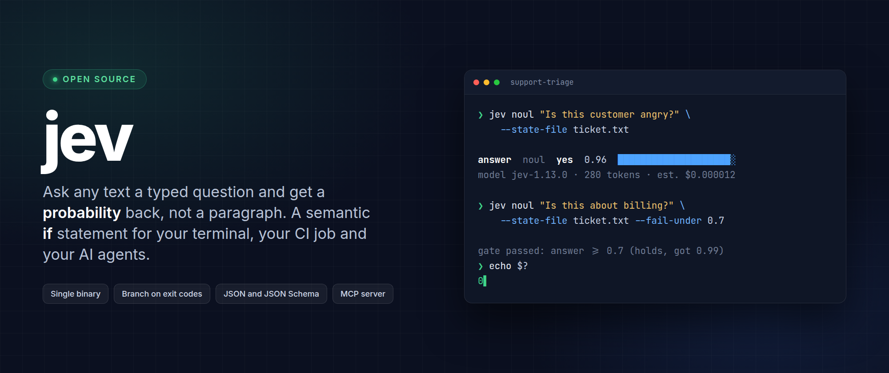

<div align="center">



### Ask any text a typed question. Get a probability back, not a paragraph.

`jev` is a command-line tool for TypeSafe AI's **Jev** model, the model that never writes text.
Send it some content and a question you defined, get a calibrated probability, and branch on it
in a shell script, a CI job or an AI agent. It is a **semantic `if` statement** for your terminal.

[](https://github.com/shaharia-lab/jev-cli/releases/latest)
[](https://github.com/shaharia-lab/jev-cli/actions/workflows/ci.yml)
[](https://crates.io/crates/jev-cli)
[](https://github.com/shaharia-lab/jev-cli/releases)
[](https://github.com/shaharia-lab/jev-cli/stargazers)
[](#licence)

**[Quick start](#-quick-start) · [What can I use it for?](#-what-can-i-use-it-for) · [Documentation](docs/README.md) · [Command reference](docs/commands.md) · [FAQ](docs/user-guide/faq.md)**

<br>

### ⭐ Useful idea? [Star the repo.](https://github.com/shaharia-lab/jev-cli)

It takes two seconds, and it is how the next person finds `jev`.

</div>

---

## 🎬 See it in action

Ask a question, get a probability, branch on the exit code, then ask several questions at once.


> [!IMPORTANT]
> **Unofficial project.** `jev` is community-built. It is not affiliated with, endorsed by, or
> sponsored by TypeSafe AI. "TypeSafe" and "Jev" belong to their owner. You need a TypeSafe API
> key to use it.

---

## 🤔 What problem does this solve?

You have text: a support ticket, a commit message, a user's answer, a product review, a model's
output. You need a decision about it: is it angry, which team owns it, how risky is it, should
this pipeline continue?

Today you either write brittle keyword rules, or you ask a large language model and then parse a
sentence it might phrase differently tomorrow.

Jev is a third option. You define the question and the possible answers. The model returns a
number for each one. Your code decides what to do.

```bash
jev noul "Is this customer angry?" --state "You charged me twice. Fix it now."
```

```text
answer  noul  yes  0.91  ██████████████████░░
model jev-1.13.0 (requested jev-latest) · 42 input tokens · est. cost $0.000002 · 1 ms · request req_demo
```

One question, one number, about a hundredth of a cent. No prompt engineering, no JSON parsing,
no "As an AI language model".

| | LLM prompt | `jev` |
| --- | --- | --- |
| You get back | A sentence to parse | A number in a shape you defined |
| Same input tomorrow | May be worded differently | Same contract, always |
| Cost of a short ticket | Cents | A fraction of a cent |
| Use in a shell script | Parse and hope | Exit code 0 or 10 |

---

## 💡 What can I use it for?

Anywhere a program needs a judgment about content. A few that people reach for first:

| Use case | The question you ask |
| --- | --- |
| **Triage support tickets** | Which team owns this, how urgent is it, how upset is the customer |
| **Route incoming messages** | Sales, support, or spam |
| **Moderate user content** | Does this break the rule, with the borderline cases sent to a person |
| **Gate a CI job** | Does this commit describe a user-facing change, so it needs a changelog entry |
| **Guard an AI pipeline** | Is the user's input on topic, and did the model's answer actually answer it |
| **Score feedback at scale** | How positive is each of 50,000 reviews, as one batch run |
| **Label a dataset** | Turn a folder of documents into labelled rows, resumable if it breaks |
| **Detect intent in a form** | Is this person asking to cancel, and is a refund being requested |
| **Check a document** | Does this contract mention auto-renewal, in plain language |

Each of these is one command:

```bash
# Is this message angry? Exit 0 when yes is 0.7 or more, exit 10 when it is not
jev noul "Is this message angry?" --state-file message.txt --fail-under 0.7

# Which team should handle this ticket?
jev choice "Which team should handle this?" --state-file ticket.txt \
  --option billing --option technical --option other

# How frustrated is this customer, on a scale you describe?
jev score "How frustrated is the customer?" --state-file ticket.txt \
  --level Calm --level Frustrated --level "Very angry"
```

More ideas, and how to phrase a question so it works, in
[writing good questions](docs/user-guide/writing-questions.md).

---

## ⚡ Quick start

Three steps, about a minute, a fraction of a cent.

<details open>
<summary><b>1. Installation</b> - pick your platform</summary>

<br>

| Method | Command |
| --- | --- |
| **Install script** (Linux, macOS) | `curl -fsSL https://raw.githubusercontent.com/shaharia-lab/jev-cli/main/install.sh \| sh` |
| **Install script** (Windows) | `irm https://raw.githubusercontent.com/shaharia-lab/jev-cli/main/install.ps1 \| iex` |
| **Homebrew** (macOS, Linux) | `brew install shaharia-lab/tap/jev` |
| **Cargo, prebuilt** | `cargo binstall jev-cli` |
| **Cargo, from source** | `cargo install jev-cli --locked` |

The install scripts never use `sudo`, always check the download's SHA-256, and check its
[minisign](https://jedisct1.github.io/minisign/) signature when minisign is installed. Homebrew
also sets up the man pages and shell completions. Options, verification and uninstalling are in
the [installation guide](docs/user-guide/installation.md).

</details>

<details open>
<summary><b>2. Give it a key</b></summary>

<br>

Create one in the [TypeSafe console](https://console.typesafe.ai/keys), then either export it,
which is what CI jobs and agents should do:

```bash
export TYPESAFE_API_KEY=...
```

or store it once, in a private file only you can read:

```bash
jev auth login
jev auth status
```

The key is never accepted as a flag value, so it cannot land in your shell history, and only its
last four characters are ever shown.

</details>

<details open>
<summary><b>3. Ask something</b></summary>

<br>

```bash
jev noul "Is this message angry?" --state "You charged me twice. Fix it now."
```

Piped or redirected, the same command prints JSON instead of a table, and `--field noul` prints
`0.91` and nothing else.

</details>

> [!TIP]
> Ask several questions about the same content in **one** call. Extra questions cost tokens, not
> round trips, and the content is only paid for once.

---

## ❓ The three kinds of question

| Type | Command | You get back | Ask it when |
| --- | --- | --- | --- |
| **noul** | `jev noul` | The probability of yes, 0 to 1 | A property either holds or it does not |
| **choice** | `jev choice` | The winning option, its confidence, and a probability for each | Exactly one of up to 255 options must win |
| **score** | `jev score` | A position on your scale, and a confidence | A described scale of 2 to 10 levels |

A probability near 0.5 means the model cannot tell, not "medium". `--abstain-band 0.4,0.6` turns
that into its own exit code, so those cases can go to a person. Jev reads literally: it cannot
count, do arithmetic or compare dates, so keep that in your code.

Details and worked examples: [the three question types](docs/user-guide/question-types.md).

---

## 🧩 Many questions at once

One content, several questions, one call. Write `triage.yaml`:

```yaml
model: jev-latest
questions:
  is_urgent:
    type: noul
    instructions: Does this ticket convey urgency?
    criteria:
      "true": Explicitly time-sensitive
      "false": No urgency expressed
  department:
    type: choice
    instructions: Which team should handle this?
    criteria:
      billing: Payments, invoicing, refunds
      technical: Bugs, outages, integrations
      other: ~
  frustration:
    type: score
    instructions: How frustrated is the customer?
    criteria:
      - Calm
      - Frustrated
      - Very angry
```

Check it for free, then run it:

```bash
jev validate -f triage.yaml --state-file ticket.txt
jev eval -f triage.yaml --state-file ticket.txt
jev eval -f triage.yaml --state-file ticket.txt --field answers.department.choice
```

`jev validate` sends nothing and needs no key. `jev eval --dry-run` goes further and prints the
exact request and what it should cost.

To run the same questions over thousands of rows, with concurrency, back-off and a `--resume`
that survives a crash, use `jev batch run`: see [many rows at once](docs/user-guide/batch.md).

---

## 🔧 Built for scripts, CI and agents

**stdout is data. stderr is everything else.** Exit codes are a stable contract, so a script
never has to parse output:

| Code | Meaning |
| ---: | --- |
| 0 | Success, and any gate condition holds |
| 2 | Usage or validation error. Nothing was sent, nothing was billed |
| 3 | No API key, or the API refused it |
| 10 | Evaluated, and the gate condition is false. Never an error |
| 11 | Evaluated, and the answer is inside the abstain band |

```bash
if jev noul "Is this ticket about billing?" --state-file ticket.txt --fail-under 0.7 --quiet; then
  echo "billing"
fi
```

The full table, gating flags, JSON shapes, the error object and a GitHub Actions example are in
[scripting and CI](docs/user-guide/scripting-and-ci.md) and
[exit codes and JSON contract](docs/user-guide/exit-codes.md).

---

## 🤖 For AI agents

`jev` treats agents as first-class users, not an afterthought.

- **Self-describing.** `jev spec` prints every command, flag, default, exit code and example as
  one JSON document, and every `--help` says *when to use this command rather than its siblings*.
- **Schemas, not guesswork.** `jev schema request|questions|batch-record|output|error` prints
  JSON Schemas for everything `jev` reads and writes.
- **Free dry runs.** `jev validate` and `--dry-run` check a request offline, so an agent can fix
  its own mistake before spending anything.
- **MCP server.** `jev mcp serve` exposes the same functionality as MCP tools, with a per-call
  spend cap and file access that is deny-by-default.

```bash
claude mcp add jev -- jev mcp serve
```

There is also an [agent skill](skills/jev-cli/SKILL.md) that teaches the whole workflow:

```bash
claude plugin marketplace add shaharia-lab/jev-cli
claude plugin install jev@jev-cli
```

Setup for Claude Desktop, Cursor, VS Code and any other MCP client, plus the spend caps, is in
[AI agents and MCP](docs/user-guide/mcp.md).

---

## 🔐 Privacy and security

- **No telemetry, ever.** `jev` contacts exactly two hosts: the TypeSafe API when you evaluate
  something, and GitHub Releases when it checks for an update, which you can turn off.
- **Your content stays yours.** It goes to the API and nowhere else, and is never written to a
  log unless you explicitly ask for that.
- **The key is never exposed.** Not as a flag, not in logs, errors, dry-run output or MCP
  results. Only its last four characters are ever shown.
- **HTTPS only**, certificate verification cannot be disabled, and redirects are never followed.
- **Signed updates.** Every download is checked against a signature and a checksum before
  anything is replaced, and `jev` never downgrades on its own.

[SECURITY.md](SECURITY.md) has the full model, how to verify a release yourself, and how to
report a vulnerability privately. Please do not open a public issue for one.

---

## 📚 Documentation

<table>
<tr>
<td valign="top" width="50%">

**User guide**

- [Installation](docs/user-guide/installation.md)
- [Quick start](docs/user-guide/quick-start.md)
- [The three question types](docs/user-guide/question-types.md)
- [Writing good questions](docs/user-guide/writing-questions.md)
- [Scripting and CI](docs/user-guide/scripting-and-ci.md)
- [Exit codes and JSON contract](docs/user-guide/exit-codes.md)
- [Many rows at once](docs/user-guide/batch.md)
- [Configuration and profiles](docs/user-guide/configuration.md)
- [AI agents and MCP](docs/user-guide/mcp.md)
- [Keeping jev up to date](docs/user-guide/updates.md)
- [Troubleshooting](docs/user-guide/troubleshooting.md)
- [FAQ](docs/user-guide/faq.md)

</td>
<td valign="top" width="50%">

**Reference and development**

- [Command reference](docs/commands.md), generated from the binary
- [Development setup](docs/development/setup.md)
- [Architecture](docs/development/architecture.md)
- [Testing](docs/development/testing.md)
- [Releasing](docs/development/release.md)
- [How the API actually behaves](docs/development/api-behaviour.md)
- [Threat model](docs/development/threat-model.md)

<br>

```bash
jev --help          # every command
jev spec            # the whole contract, as JSON
jev schema request  # what a request file may contain
```

</td>
</tr>
</table>

---

## 🙋 FAQ

<details>
<summary><b>How is this different from asking an LLM?</b></summary>

<br>

An LLM writes a sentence you then have to parse, and it may phrase things differently tomorrow.
Jev returns a number in a shape you specified, so your code can branch on it. It is also much
faster and much cheaper, because it generates nothing. It is not a replacement for an LLM: it is
the piece you reach for when the job is a decision.

</details>

<details>
<summary><b>What does it cost?</b></summary>

<br>

Only input tokens are billed, so a short ticket costs a small fraction of a cent. `jev` always
labels a cost as an estimate, and `--dry-run` prices a run before you send it.

</details>

<details>
<summary><b>Do I need a TypeSafe account?</b></summary>

<br>

Yes, for anything that evaluates content. Everything offline is free and needs no key:
`jev validate`, `jev schema`, `jev spec`, `jev completion` and any command with `--dry-run`.

</details>

<details>
<summary><b>Are the answers repeatable?</b></summary>

<br>

Not bit for bit. Compare against thresholds, never for equality, and pin a versioned model such
as `jev-1.13.0` for anything that must stay stable. The alias `jev-latest` moves to new versions
without notice.

</details>

<details>
<summary><b>Can I run it on thousands of files?</b></summary>

<br>

Yes. `jev batch run` streams JSONL or CSV, so memory does not grow with the file, backs off when
the API rate limits, writes one JSON record per row, and picks up where it stopped with
`--resume`.

</details>

<details>
<summary><b>Where does my API key live?</b></summary>

<br>

In `TYPESAFE_API_KEY`, or in a private credentials file with mode `0600`. There is no OS keychain
and no browser flow, by design.

</details>

More answers: [the full FAQ](docs/user-guide/faq.md) and
[troubleshooting](docs/user-guide/troubleshooting.md).

---

## ⭐ Spread the word

`jev` is a young project around a young model. The fastest way to keep it alive is to make it
easier for the next person to find.

<div align="center">

**[⭐ Star jev](https://github.com/shaharia-lab/jev-cli)** ·
**[🐛 Report something broken](https://github.com/shaharia-lab/jev-cli/issues)** ·
**[💬 Share what you built](https://github.com/shaharia-lab/jev-cli/discussions)**

</div>

---

## 🤝 Contributing

Pull requests are welcome. [CONTRIBUTING.md](CONTRIBUTING.md) explains the workflow and the
quality gates, and [CLAUDE.md](CLAUDE.md) is the architecture guide that contributors and AI
agents both work from.

```bash
git clone https://github.com/shaharia-lab/jev-cli
cd jev-cli
make check          # everything CI runs
```

Security problems go privately through [SECURITY.md](SECURITY.md), never a public issue.

## Licence

Licensed under either of [Apache License, Version 2.0](LICENSE-APACHE) or
[MIT license](LICENSE-MIT) at your option.

Unless you explicitly state otherwise, any contribution intentionally submitted for inclusion in
this project by you, as defined in the Apache-2.0 licence, shall be dual licensed as above,
without any additional terms or conditions.

<div align="center">
<br>

**Built by [Shaharia Lab](https://github.com/shaharia-lab)** · powered by
[TypeSafe AI](https://typesafe.ai)

⭐ [Star jev](https://github.com/shaharia-lab/jev-cli) if it saved you a prompt.

</div>
